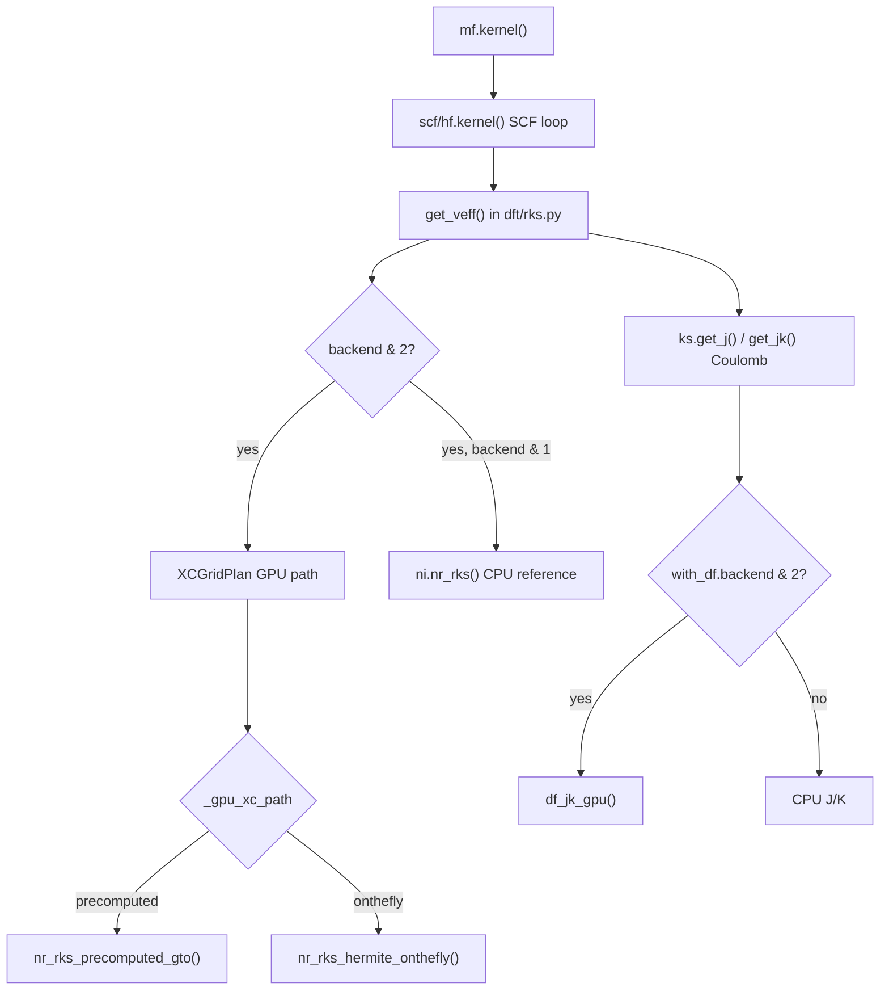

## Executive summary

OpenCL in this repo **does not patch `numint.py` directly**. The hook is in `pyscf/dft/rks.py:get_veff()`: when `mf.backend & 2`, it **bypasses the entire CPU XC integration** `ni.nr_rks(...)` and calls `XCGridPlan` methods from `pyscf/OpenCL/xc_grid.py` instead. Grid construction, SCF driver, and Coulomb J (unless density-fitted with GPU backend) still run on CPU.

Supported XC types: **LDA and GGA only** (`XCGridPlan` raises for MGGA).

---

## DFT execution path (where OpenCL hooks in)



**Setup (once before SCF):**

```550:578:pyscf/dft/rks.py
    def setup_gpu(self, mol=None, dm=None, xc_path='precomputed', gpu_xc='auto', profile=None, **kwargs):
        ...
        if xc_path == 'precomputed':
            from pyscf.OpenCL.xc_grid import setup_precomputed_gto
            self._xc_gpu_plan = setup_precomputed_gto(...)
            self._gpu_xc_path = 'precomputed'
        elif xc_path == 'onthefly':
            from pyscf.OpenCL.xc_grid import setup_xc_grid_gpu
            self._xc_gpu_plan = setup_xc_grid_gpu(...)
            self._gpu_xc_path = 'onthefly'
```

**Per SCF iteration (XC only):**

```77:109:pyscf/dft/rks.py
    backend = getattr(ks, 'backend', 1)  # 1=CPU, 2=GPU, 3=both
    ...
        if backend & 2:
            plan = getattr(ks, '_xc_gpu_plan', None)
            ...
            if xc_path == 'precomputed':
                n_gpu, exc_gpu, vxc_gpu = plan.nr_rks_precomputed_gto(dm, profile=profile)
            else:
                n_gpu, exc_gpu, vxc_gpu = plan.nr_rks_hermite_onthefly(dm, profile=profile)
        if backend & 1:
            n, exc, vxc = ni.nr_rks(mol, ks.grids, ks.xc, dm, max_memory=max_memory)
        ...
        elif backend == 2:
            n, exc, vxc = n_gpu, exc_gpu, vxc_gpu
```

`backend`: `1`=CPU, `2`=GPU, `3`=both (parity compare).

---

## Exact CPU functions bypassed

The CPU XC path is `NumInt.nr_rks()` in `pyscf/dft/numint.py`:

```1127:1157:pyscf/dft/numint.py
    def block_loop(ao_deriv):
        for ao, mask, weight, coords \
                in ni.block_loop(mol, grids, nao, ao_deriv, max_memory=max_memory):
            for i in range(nset):
                rho = make_rho(i, ao, mask, xctype)          # eval_rho / eval_rho1 / eval_rho2
                exc, vxc = ni.eval_xc_eff(...)[:2]             # libxc
                ...
                yield i, ao, mask, wv
    ...
        for i, ao, mask, wv in block_loop(ao_deriv):
            _dot_ao_ao_sparse(ao, ao, wv, ...)               # LDA vmat
        ...
            aow = _scale_ao_sparse(ao[:4], wv[:4], ...)      # GGA weighted AO
            _dot_ao_ao_sparse(ao[0], aow, ...)               # GGA vmat
        vmat = lib.hermi_sum(vmat, axes=(0,2,1))
```

| CPU function (numint) | Role | OpenCL replacement |
|---|---|---|
| **`NumInt.nr_rks()`** | Full XC: nelec, exc, Vxc matrix | **`nr_rks_precomputed_gto()`** or **`nr_rks_hermite_onthefly()`** |
| **`NumInt.block_loop()`** | Grid blocking + AO eval per block | Not used in GPU SCF path; precomputed AOs uploaded at setup, or Hermite kernels evaluate AO on-the-fly |
| **`NumInt.eval_ao()`** | GTO AO values/derivs on grid | **Setup only** (precomputed): CPU `eval_ao` or GPU `eval_ao_hermite_cart_deriv1_tiled`; **onthefly**: `rho_*_tiled` / `rho_*_pair` fuse AO+rho |
| **`make_rho()` → `eval_rho` / `eval_rho1` / `eval_rho2`** | ρ and ∇ρ from AO×DM | `contract_rho_*`, `rho_lda_tiled`, `rho_gga_tiled`, `rho_*_precomp_*`, `rho_*_pair` |
| **`NumInt.eval_xc_eff()`** | libxc vrho, vsigma | **`pbe_xc_f32` / `pbe_xc_f64`** + `compute_wv_gga_*` (GGA PBE, `xc_eval='gpu'`) or still CPU libxc (`xc_eval='cpu'`) |
| **`_scale_ao` / `_scale_ao_sparse`** | Weighted AO for vmat | `scale_aow_lda`, `scale_aow_gga_split` |
| **`_dot_ao_ao_sparse`** | Vxc matrix assembly | `matmul_gpu_buf_accum` (aoᵀ @ aow) or fused `vmat_*_tiled` / `vmat_*_precomp_*` |
| **`lib.hermi_sum(vmat)`** | Symmetrize GGA vmat | Still CPU: `vmat + vmat.T` after GPU (wv[0] halved on device) |

**Not replaced by OpenCL XC path:**
- `gen_grid.Grids.build()` — grid coords/weights/non0tab
- `ni.nr_nlc_vxc()` — NLC grids (still CPU in `get_veff`)
- `ks.get_j()` / `ks.get_jk()` — Coulomb/exchange (CPU unless DF GPU below)
- Hybrid HF exchange fraction — still CPU J/K

---

## Two GPU XC paths

### 1. Precomputed GTO (`xc_path='precomputed'`, default)

**Entry points:**
- Setup: `setup_precomputed_gto()` / `RKS.setup_gpu(xc_path='precomputed')`
- Per-SCF: `plan.nr_rks_precomputed_gto(dm)`

**Flow per SCF iteration** (`_nr_rks_precomputed_gpu`):
1. H2D density matrix
2. **ρ on GPU** — `_precomp_rho_fused` or `_precomp_rho_blocked`
3. **XC on GPU or CPU** — `_xc_after_rho` → `pbe_xc_*` (default) or `eval_xc_eff` (debug)
4. **Vxc matrix on GPU** — `_precomp_vmat_fused` or `_precomp_vmat_blocked`
5. D2H vmat (+ `vmat.T` for GGA)

**AO evaluation timing:**
- At **setup** (not per SCF): CPU `ni.eval_ao()` block loop, or GPU Hermite projection (`ao_proj='hermite_gpu'` / `auto`)
- Per-SCF: only ρ/vmat projection from pre-uploaded `buf_ao`

**Fused kernel variants** (`fused=` in setup):
| Mode | ρ kernels | vmat kernels |
|---|---|---|
| `tiled` (default) | `rho_*_precomp_pair` | `vmat_*_precomp_pair` |
| `coalesced` | `rho_gga_precomp_coalesced_pair` | `vmat_gga_precomp_coalesced_pair` |
| `radial_precomp` | `rho_gga_radial_precomp_pair` (no AO upload) | `vmat_gga_radial_precomp_pair` |
| `False` (blocked) | `contract_rho_*_from_aodm` + GEMM | `scale_aow_*` + `matmul_gpu_buf_accum` |

### 2. On-the-fly Hermite (`xc_path='onthefly'`)

**Entry points:**
- Setup: `setup_xc_grid_gpu()` / `RKS.setup_gpu(xc_path='onthefly')`
- Per-SCF: `plan.nr_rks_hermite_onthefly(dm)`

**Flow:**
1. DM → cartesian DM on GPU
2. **`rho_lda_tiled` / `rho_gga_tiled`** (or `*_pair`) — AO eval + ρ in one kernel from Hermite radial tables
3. XC (`pbe_xc_*` or CPU libxc)
4. **`vmat_lda_tiled` / `vmat_gga_tiled`** — Vxc matrix without explicit AO storage
5. cartesian vmat → spherical via `c2s` (CPU matmul)

Replaces both **`eval_ao`** and **`eval_rho`** per iteration.

---

## Key OpenCL kernels (`kernels.cl` + `pbe.cl`)

**Density (replaces `eval_rho`):**
- `contract_rho`, `contract_rho_grad`, `contract_rho_lda_from_aodm`, `contract_rho_gga_from_aodm`
- `rho_lda_tiled`, `rho_gga_tiled`, `rho_lda_pair`, `rho_gga_pair`
- Precomp: `contract_rho_lda_precomp`, `contract_rho_gga_precomp`, `rho_*_precomp_*`

**Vxc matrix (replaces `_scale_ao` + `_dot_ao_ao_sparse`):**
- `scale_aow_lda`, `scale_aow_gga_split`, `vxc_mat_lda`, `vxc_mat_gga`
- `vmat_lda_tiled`, `vmat_gga_tiled`, `vmat_*_pair`, `vmat_*_precomp_*`

**AO evaluation (replaces `eval_ao` in Hermite paths):**
- `eval_ao_mapped_hermite_cart*`, `eval_ao_hermite_cart_deriv1_tiled`
- `eval_gto_sph`, `eval_gto_sph_deriv1` (GTO path)

**XC functional (replaces `eval_xc_eff` for PBE):**
- `pbe_xc_f32`, `pbe_xc_f64`, `sanitize_pbe_xc_f32`, `compute_wv_gga_f32/f64` in `pbe.cl`

**Linear algebra helpers:**
- `matmul_tiled*`, `zero_buffer`

---

## Secondary hook: density-fitted J/K (`df_jk.py`)

Separate from XC. When `mf.with_df.backend & 2`:

```280:296:pyscf/df/df_jk.py
    backend = getattr(dfobj, 'backend', 1)
    if backend & 2:
        from pyscf.OpenCL.df_jk import df_jk_gpu
        vj_gpu, vk_gpu = df_jk_gpu(dfobj, dm, hermi, with_j, with_k)
```

Replaces CPU `df_jk._get_jk_cpu()` / `get_jk()` with GPU GEMM chains (`matmul_gpu_buf`, `unpack_tril_batched`, `transpose_k_buf1_batched`). Wired via `gpu_profiles.py` (`df_backend`).

---

## Public API surface (`xc_grid.py` module functions)

| Function | When |
|---|---|
| `setup_precomputed_gto()` | Pre-SCF AO upload + buffer alloc |
| `nr_rks_precomputed_gto()` | Per-SCF XC (production precomputed path) |
| `setup_xc_grid_gpu()` | Pre-SCF Hermite table + kernel args |
| `nr_rks_hermite_onthefly()` / `nr_rks_gpu()` | Per-SCF Hermite on-the-fly XC |
| `nr_rks_precomputed_rho_only()` / `nr_rks_precomputed_vmat_only()` | Parity/debug splits |
| `get_xc_grid_plan()` | Cached `XCGridPlan` instance |

---

## What still touches `numint.py` on GPU runs

Even with `backend=2`, `XCGridPlan` keeps a `NumInt()` instance for:
- `_xc_type(xc_code)` — functional classification
- **`eval_xc_eff()`** when `xc_eval='cpu'` or non-PBE GGA
- **Setup-time `eval_ao()`** on precomputed CPU AO path
- **`_nr_rks_precomputed_cpu_sparse()`** — float64 CPU reference using `_dot_ao_ao_sparse`, `_scale_ao_sparse`, `make_rho`

There is **no import of OpenCL inside `numint.py`**; integration is entirely through `rks.py:get_veff()` and optional `df_jk.py:get_jk()`.