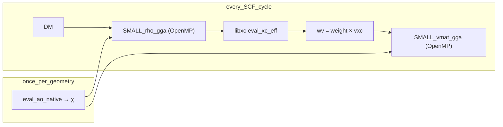

## Summary

**smallDFT** is a CPU fast path for RKS grid XC on small molecules (`nao ≲ 200`, `ngrids ~ 30k–150k`). It replaces PySCF `numint.nr_rks` grid ρ/vmat with **grid-tile OpenMP kernels** in `libsmalldft.so`, keeping libcint AO layout (F-contiguous `(ngrids, nao)`). Python is thin orchestration: AO eval, libxc, ctypes dispatch. The deprecated Python `ThreadPoolExecutor` tile path remains as fallback when `libsmalldft` is not built.

libcint already evaluates grid AO blocks with OpenMP. `GridWorkspace` now
passes reusable raw storage directly to that evaluator, removing the transient
χ allocation and copy at every geometry update. Full `nr_rks` scaling still
depends on AO, libxc, and vmat balance, so it must be measured per host.

## Data flow (one SCF `get_veff` with AO cached)



## Memory layout (critical)

| array | shape | order | index |
|-------|-------|-------|-------|
| χ (LDA) | `(ngrids, nao)` | F | `χ[g, μ] → g + μ·ngrids` |
| χ (GGA) | `(4, ngrids, nao)` | per-comp F | component `c` at `+ c·ngrids·nao` |
| DM | `(nao, nao)` | C | `dm[μ, ν] → μ·nao + ν` |
| ρ (GGA) | `(4, ngrids)` | C | `ρ[c, g] → c·ngrids + g` |
| wv | `(4, ngrids)` | C | same as ρ |
| vmat | `(nao, nao)` | C | `V[μ, ν] → μ·nao + ν` |

**No Python copy** into kernels: ctypes passes the NumPy buffer pointer. BLAS uses `lda=ngrids` on χ tiles so grid slices need no pack buffer (unlike a naive row-major GEMM).

`GridWorkspace.chi` must come from `eval_ao_native`. The workspace owns a
separate C-contiguous raw buffer which libcint fills; the returned χ view keeps
`chi[0]` F-contiguous for the C kernels. Do not substitute a manually shaped χ
array for this view.

## API

### Library

```python
from pyscf import gto, dft, lib
from pyscf.dft import numint
from pyscf.smallDFT import nr_rks, GridWorkspace, has_c_lib

lib.num_threads(4)          # OpenMP for C kernels + libcint/libxc
mol = gto.M(atom=..., basis='6-31g')
mf = dft.RKS(mol, xc='PBE'); mf.grids.level = 3; mf.grids.build()
mf.kernel(); dm = mf.make_rdm1()
ni = numint.NumInt()

# SCF-style: cache AO once per geometry
ws = GridWorkspace(mol, mf.grids, deriv=1)
ws.eval_ao(mol, mf.grids)
nelec, exc, vmat = nr_rks(ni, mol, mf.grids, 'PBE', dm, n_workers=4, ws=ws)

print('C kernels:', has_c_lib())  # True after build
```

### Monkey-patch dispatch

```python
from pyscf.smallDFT import enable, disable
enable(nao_max=200, n_workers=4)   # patches NumInt.nr_rks for small systems
# ... mf.kernel() ...
disable()
```

### Build C extension

```bash
pyscf/lib/smalldft/build.sh
# → pyscf/lib/libsmalldft.so
```

Or full PySCF cmake: `add_subdirectory(smalldft)` in `pyscf/lib/CMakeLists.txt`.

### Environment

| variable | value | why |
|----------|-------|-----|
| `OPENBLAS_NUM_THREADS` | `1` | avoid oversubscription with explicit grid OpenMP |
| `OMP_NUM_THREADS` | `N` | optional; `lib.num_threads(N)` is authoritative in PySCF |
| `PYTHONPATH` | repo root | run repo Python over pip install |

## C kernels (`libsmalldft`)

| symbol | role |
|--------|------|
| `SMALL_rho_lda` | ρ(g) = χᵀ DM χ; OpenMP over grid tiles |
| `SMALL_rho_gga` | GGA ρ + ∇ρ; one `DM@χ₀` GEMM per tile, hermi=1 convention |
| `SMALL_vmat_lda` | V += Σ_g wv(g) χᵀ χ; private `V_t` + critical reduce |
| `SMALL_vmat_gga` | V += χ₀ᵀ aow; F-order tile `aow = Σ_c wv_c χ_c`; hermi `V += Vᵀ` via temp buffer |

Tile size `TILE=512` (build-time override: `SMALLDFT_TILE=1024 pyscf/lib/smalldft/build.sh`). ρ/vmat use strided `dgemm`; scalar tile loops are ordered as AO outer / grid inner so the hot inner loop is stride-1 over grid points. `TILE=1024/2048` was slower for benzene 6-31g after the stride-1 rewrite.

## Parity

| pair | tolerance | test |
|------|-----------|------|
| C ρ vs Python `rho_gga` | ~1e-12 | `test_small_dft.py --rho` |
| C vmat vs Python `vmat_gga` | ~1e-14 | same |
| `smallDFT.nr_rks` vs `numint.nr_rks` (PBE) | vmat ~1e-14 | `test_small_dft.py` |
| LDA C ρ | ~1e-13 | `test_small_dft.py` |
| Reused workspace AO + `nr_rks` vs reference | AO exact; vmat ~1e-14 | `test_small_dft.py` |

Run: `PYTHONPATH=/home/prokop/git/pyscf python3 expamples_prokop/test_small_dft.py`

## Profiling

```python
from pyscf.smallDFT import profile_xc_bottleneck, profile_compare
profile_xc_bottleneck('benzene', nthreads=8)  # ρ / libxc / vmat breakdown
```

Benchmark tables: `/home/prokop/git/pyscf/doc/CPU_benchmark.md` (includes one-SCF-cycle Amdahl profile)

## Design decisions

- **Grid axis = parallel axis** — each OpenMP thread owns disjoint `g` slices for ρ; private `V_t` for vmat (no atomics in hot loop).
- **C/OpenMP only for production** — Python thread pool capped ~2× on ρ; abandoned for vmat.
- **Keep libcint χ layout** — no transpose to `(nao, ngrids)`; BLAS strides match F-order tiles.
- **AO cached across SCF** — `GridWorkspace` + `ws.eval_ao()` once per geometry; biggest win after ρ/vmat are fast.

## Open issues / next work

| P | item | notes |
|---|------|-------|
| 1 | Improve RI-J / DF J | dominates the converged cycle after cached XC is accelerated |
| 2 | Fuse tiled rho → libxc → vmat | requires tile-local vmat reduction; not a direct one-pass GGA fusion |
| 3 | vmat bandwidth tuning | scales less than rho once all cores are available |
| 4 | Attach `GridWorkspace` on `mf` in `patch.enable()` | zero setup boilerplate |

## Related docs

- Lessons learned: `/home/prokop/git/pyscf/doc/CPU_optimixation_experience.md` — strategies, caveats, false premises, generalization
- Plan / analysis chat: `/home/prokop/git/pyscf/doc/CPU_small_DFT.chat.md`
- Benchmarks: `/home/prokop/git/pyscf/doc/CPU_benchmark.md`
- OpenCL analogue: `/home/prokop/git/pyscf/doc/OpenCL_rho_vmat_how_it_works.md`
- Topical audit: `/home/prokop/git/pyscf/doc/topical_audit.md` (CPU smallDFT section)
